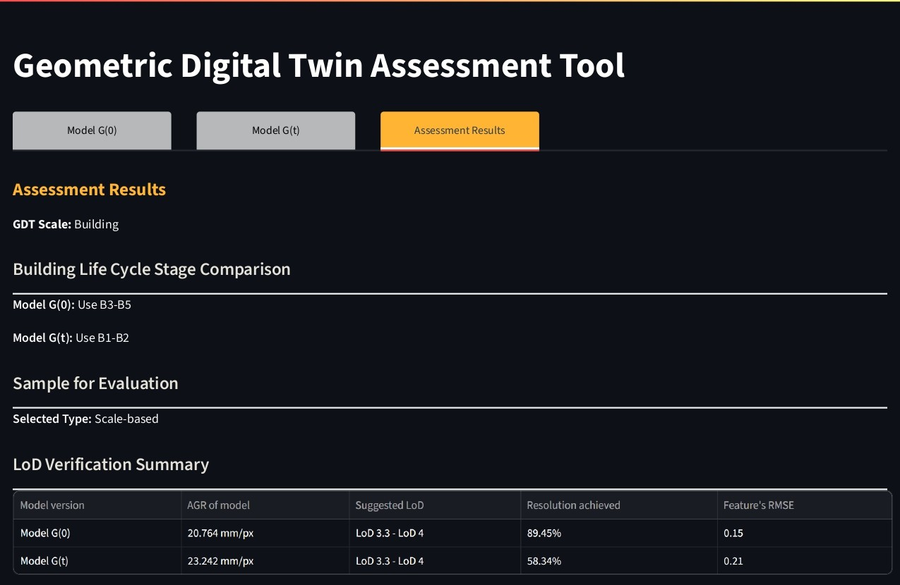

# gdt_tool

This web tool is an implementation of *A Framework for Assessing and Updating Photogrammetry-Based Geometric Digital Twins*.

🗃️ **Try the tool:** [Geometric Digital Twin Assessment Tool](https://gdttool-01.streamlit.app/)

📘 **User guide:** [Geometric Digital Twin Assessment Tool User Guide](gdt_tool_user_guide.pdf)

For more details, see: [link will be here]

